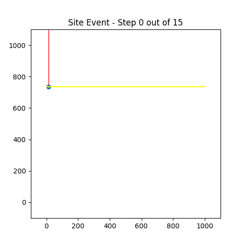
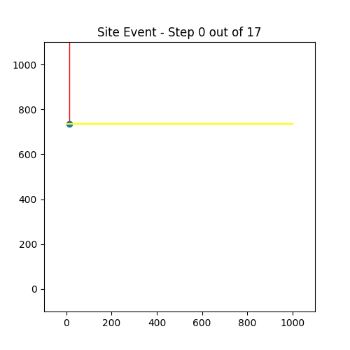

# Voronoi Fortune Visualized

The repository contains application that computes Voronoi diagram using Fortune's algorithm with euclidean and manhattan metric. See [notebook](notebooks/fortune-visualisation.ipynb) for interactive graph.

# Requirements

- Python 3.10
- poetry
- Jupyter  (for visualization)

# Run

```
git clone https://github.com/jaroslavknotek/voronoi-fortune-visualized.git

cd voronoi-fortune-visualized

poetry install
```

Poetry will setup new environment (the name is generated so we call it `fortune-env`)

Then execute these command
```
# adds support for `fortune-env` kernel to jupyter notebook
python -m ipykernel install --user --name='fortune-env'
```

Run `jupyter notebook`, open [notebook](notebooks/fortune-visualisation.ipynb) and switch selected kernel to `fortune-env`

You can then play with the points setup for the algorithm and see the output.

# Results

## Manhattan



## Euclidean 




# Acknowledgmens
- The code isn't perfect, it's a playground for experimenting with algorithm, animation and bit of math
- Basis for the code was jansonh's solution https://github.com/jansonh/Voronoi. However, the code has to be adapted to new metric resulting in drastic changes.

